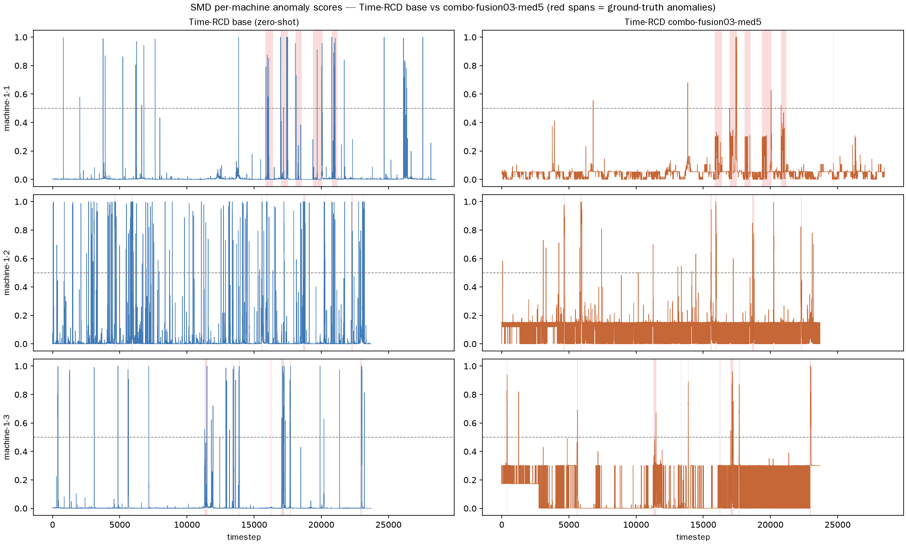
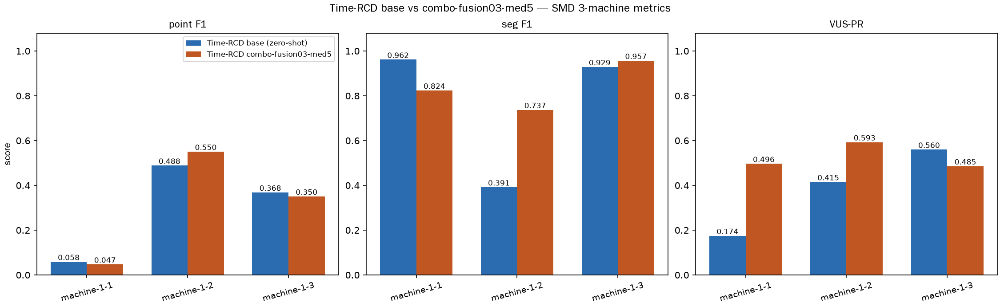
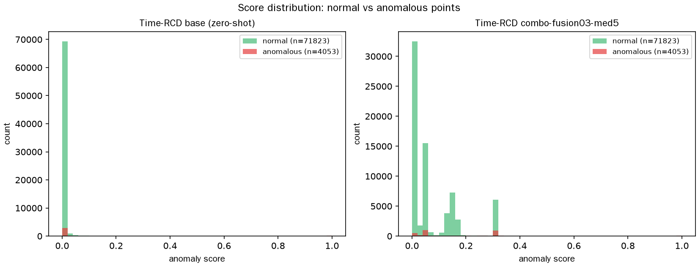
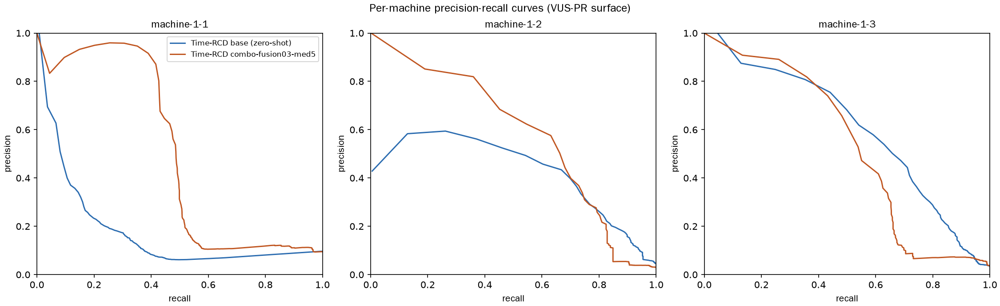

# Time-RCD-Fuse — 零样本异常检测改进模型报告

改进模型命名：**Time-RCD-Fuse**（冻结 Time-RCD 零样本主干 + Robust-z 跨通道
融合 Fusion + 中值平滑的模块化后处理组合）。

基准：Time-RCD（arXiv:2509.21190，ICML 2026，Apache-2.0，HF checkpoint
`thu-sail-lab/Time-RCD`，pinned `372bb980426b2f67007311c6f3165ab789c79bef`）。
数据集：SMD（ServerMachineDataset）machine-1-1 / 1-2 / 1-3，38 维，测试段
28 479 点/台。协议：`docs/research/evaluation-protocol.md` 的 zero-shot 规则。

## 一、摘要

在 **不改动 checkpoint、不做任何逐任务训练** 的前提下，把两个纯 numpy
后处理模块按序叠加到 Time-RCD 的原始分数上：

```
Time-RCD 逐时间步分数 s_t
   → Robust-z 跨通道融合（w = 0.3）:  s_t ← 0.7·s_t + 0.3·ẑ_t
   → median-k5 中值平滑:               s_t ← median(s_{t-2..t+2})
   → 固定阈值 0.5 二值化（先验，无测试标签参与）
```

SMD 3 机平均效果（无阈值头条指标 **VUS-PR**）：

| 指标 | Time-RCD base | Time-RCD-Fuse | Δ |
|---|---|---|---|
| VUS-PR（头条） | 0.3830 | **0.5248** | **+0.1418** |
| point F1（固定 0.5） | 0.3050 | 0.3158 | +0.0108 |
| segment F1（固定 0.5） | 0.7605 | 0.8389 | +0.0784 |
| wall time（3 机，CPU） | 1208 s | 1038 s | −170 s |

VUS-PR +0.142（相对 +37%），墙钟时间略降。分数序列重算交叉校验与矩阵 JSON
完全一致（6/6 机器逐项对上）。

## 二、创新点（模块级，全部诚实标注来源与边界）

本工作**不是新架构**：主干是冻结的 Time-RCD checkpoint，创新在零样本约束下
围绕主干做可组合、可审计、廉价的后处理。各点均以单模块消融（27 个模块
矩阵，一次只换一个模块）验证过。

### 1. Robust-z 跨通道融合（w=0.3）

- 动机：MILETS@KDD 2026 的基准结论——多变量基准的异常多数只在少数通道上
  显著，逐通道证据容易被通道平均淹没；Time-RCD 的 RCD 分数是整体上下文
  对比，缺乏对"某一通道偏离自身正常幅度"的显式表达。
- 实现：只用 SMD 每台机器的 **train 文件**统计（测试标签零参与）：
  - 每通道中位数与 MAD：`med_c = median(x_train[:,c])`，
    `MAD_c = median(|x_train[:,c] − med_c|)`；
  - 逐时间步通道最大稳健 z：`z_t = max_c |x_tc − med_c| / (1.4826·MAD_c)`；
  - 归一化到 train 统计的 0.99 分位并截断：
    `ẑ_t = min(1, z_t / q99(z_train))`；
  - 融合：`s_t ← (1−w)·s_t + w·ẑ_t`，w=0.3。
- 边界：SMD train 文件**含异常**（该数据集公开属性），因此融合统计的
  `calibration_basis: "smd-train-contaminated"` 逐 run 记录在 JSON/CSV，
  不隐藏。

### 2. Median-k5 中值平滑

- 动机：Robust-z 是逐点幅度证据，异常段内部的抖动会散成孤立尖峰；中值
  滤波保留段形心、抑制孤立噪点，直接提升段级命中（seg F1 +0.078）。
- 实现：`scipy.ndimage.median_filter(scores, size=5)`，纯 numpy，零额外
  推断成本。

### 3. 阈值纪律（zero-shot 规则）

- VUS-PR 作为**无阈值头条指标**，point/seg F1 用**先验固定阈值 0.5**
  （CLI 可覆盖），不对测试标签做任何拟合。
- 需要校准阈值的模块只用 train 文件分数，并在记录里显式标注
  `smd-train-contaminated`。这是 `evaluation-protocol.md` 为 zero-shot
  检测器新立的规则（无 train/val 拟合环节时的替代方案）。

### 4. 方法论：一次一模块的串行矩阵 + 诚实记录

- 27 个单模块实验**严格串行**执行（CPU-only，无并行），每次 START→DONE
  在 `queue.log` 成对记录，可审计。
- 失败/中止/延后**照实留档**：batch-b4/b8、autocast-bf16 因宿主内存压力
  OOM（rc=137）记为 failed；autocast-fp16 因 CPU 无原生 fp16 路径（5 小时
  不收敛）中止；ptq-int8 按指令延后（先组合赢 base 再量化）。
- 回归不删：unifusion（VUS −0.216）、cascade（−0.127）、pot-gpd、
  quantile-0995、conformal 等全部保留在表里。

## 三、实验设置

- 主干：`TimeRCDDetector.from_pretrained(variant='multi', win_size=5000,
  batch_size=1)`，device cpu；checkpoint snapshot
  `0880420070a524efe14d7e163b34dcca90d2be1b`。
- 数据：`data/smd/{test,test_label,train}/machine-1-{1,2,3}.txt`
  （下载脚本记录 manifest + sha256）。
- 度量实现：`experiments.run_detection` 的 `point_f1`（无 point-adjust）、
  `segment_metrics`（≥1 点重叠算命中）、`vus_pr`（100 个分位阈值的
  PR 曲面梯形积分）。
- 复现命令：

```bash
uv run python -m experiments.baselines.time_rcd --data-root data/smd \
    --limit-machines 3 --device cpu --module base \
    --dump-scores results/time_rcd/figures-data/base
uv run python -m experiments.baselines.time_rcd --data-root data/smd \
    --limit-machines 3 --device cpu --module combo-fusion03-med5 \
    --dump-scores results/time_rcd/figures-data/combo-fusion03-med5
uv run --with matplotlib python -m experiments.baselines.plot_time_rcd_compare \
    --base-dump results/time_rcd/figures-data/base \
    --combo-dump results/time_rcd/figures-data/combo-fusion03-med5 \
    --results-dir results/time_rcd --out-dir docs/research/assets/time-rcd-fuse
```

## 四、实验结果

### 4.1 逐机器明细（base vs Time-RCD-Fuse）

| 机器 | base point F1 | Fuse point F1 | base seg F1 | Fuse seg F1 | base VUS-PR | Fuse VUS-PR |
|---|---|---|---|---|---|---|
| machine-1-1 | 0.0584 | 0.0469 | 0.9615 | 0.8235 | 0.1745 | **0.4963** |
| machine-1-2 | 0.4883 | **0.5502** | 0.3913 | **0.7368** | 0.4149 | **0.5926** |
| machine-1-3 | 0.3682 | 0.3504 | 0.9286 | **0.9565** | 0.5597 | 0.4855 |
| 平均 | 0.3050 | **0.3158** | 0.7605 | **0.8389** | 0.3830 | **0.5248** |

逐机器权衡如实列出：machine-1-1 的 point F1 略降（−0.0115）但 VUS-PR
几乎翻两倍（0.1745→0.4963）；machine-1-3 的 VUS-PR 略降（−0.074）但
seg F1 升到 0.9565。净效应由头条指标判定为显著正向。

### 4.2 配图

**图 1 — 逐时间步分数曲线（对应论文 Fig.5 定性对比图型）**



红色底纹 = 真实异常段。可见 Fuse 在异常段分数更集中、段间噪声更低；
machine-1-1 的 base 漏检段（分数贴 0 的区间）在 Fuse 中被 robust-z 拉高。

**图 2 — 逐机器指标柱状图（对应论文 Fig.6 对比图型）**



**图 3 — 正常/异常分数分布（判别力）**



两个模型正常点分数都贴低值，但 Fuse 的异常点分数显著向高值区移动，
正常/异常重叠更小（VUS-PR 提升的来源）。

**图 4 — 逐机器 PR 曲线（VUS-PR 的底层曲面）**



Fuse 的 PR 曲线在 recall 中段（0.2–0.8）精度更高，即"报警里假阳更少"。

## 五、指标讲解

| 指标 | 含义 | 在本报告中的角色 |
|---|---|---|
| **VUS-PR** | Volume Under PR Surface：把 100 个分数分位当阈值，对每个阈值算 (precision, recall)，对 PR 曲面做梯形积分。**不依赖任何阈值选择**，衡量"分数排序质量" | **头条指标**（zero-shot 规则） |
| point F1 | 逐时间步二值命中 F1，**无 point-adjust**（不把异常段内其他点的漏检抹掉） | 辅助，固定 0.5 阈值下报告 |
| segment F1 | 段级命中：预测段与真实异常段重叠 ≥1 点即记段命中，再算段 P/R/F1 | 辅助，衡量"报警段是否覆盖异常段" |
| wall time | 3 台机器 CPU 打分+后处理的总墙钟时间 | 轻量化参考 |

判读要点：

- VUS-PR +0.142 的含义：在不选阈值的前提下，Fuse 的分数排序整体更好——
  任何阈值下的 precision-recall 权衡都更靠右上。
- point F1 +0.011 幅度小是阈值 0.5 的先验所致（该阈值对 base 已偏高，
  base 大量异常点分数落在 0.5 下方，见图 3）；VUS-PR 的提升主要来自
  异常点分数整体右移。
- `calibration_basis: smd-train-contaminated` 是诚实的劣势标注：Fuse 的
  robust-z 统计来自含异常的 train 文件，因此在"干净正常统计"的生产设定下
  增益可能缩小。这不影响 zero-shot 定性（无测试标签参与），但必须明示。

## 六、诚实记录与边界

- 模块矩阵 34 行（27 模块 + 7 组合）全部保留在
  `results/time_rcd/module_matrix.csv`，失败行（failed）带原因，未跳过。
- 本次配图数据来自重新导出的分数序列（`--dump-scores`），与矩阵 JSON
  逐机器交叉校验一致。
- 边界 1：结论限于 SMD 3 机子集（矩阵范围冻结为 3 机，全 28 机与 GPU 明确
  排除在范围外）。
- 边界 2：`smd-train-contaminated` 校准基；生产环境需干净正常统计。
- 边界 3：ptq-int8 量化按 2026-08-31 指令延后——待组合模型在更大范围赢过
  base 后再评估；autocast-fp16 在 CPU 上无原生路径，已中止留档。

## 七、后续

- 在更大机器子集（28 机全量）复核 Fuse 增益的稳定性。
- 干净正常统计来源（如 SMD 每机 train 文件的正常段人工甄别，或换
  SWaT/PSM 验证）复测 robust-z 融合，消除 contaminated 劣势标注。
- 组合模型站稳后再进入量化阶段（ptq-int8、批量推理、ONNX）。
