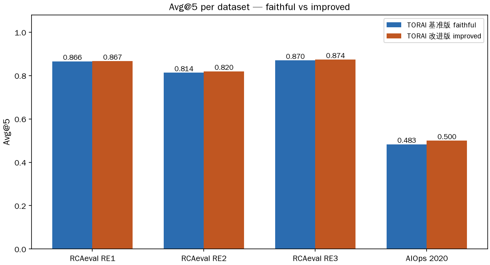
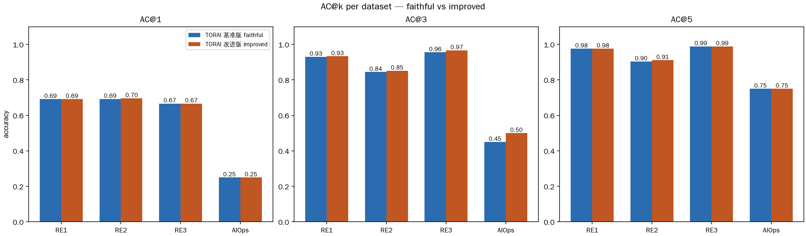
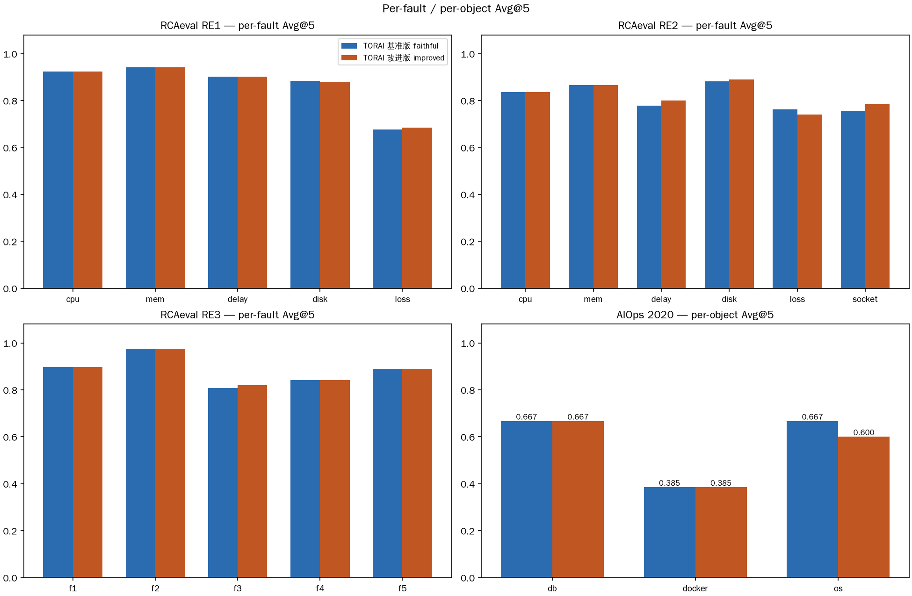
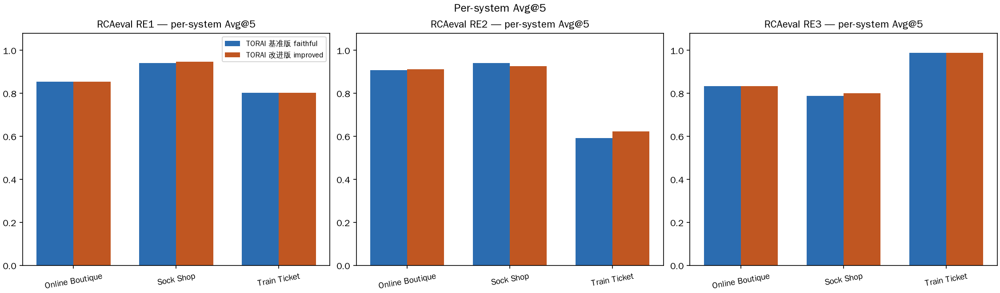
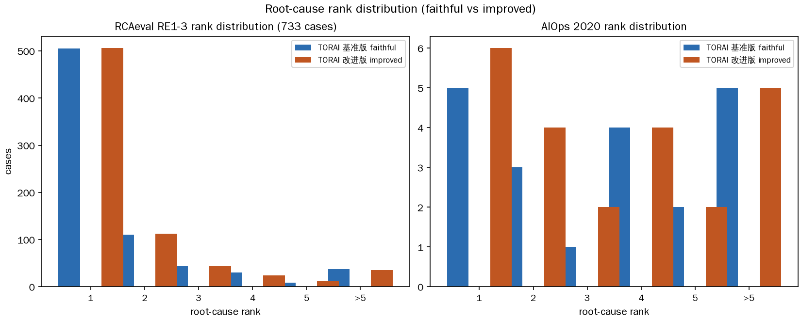
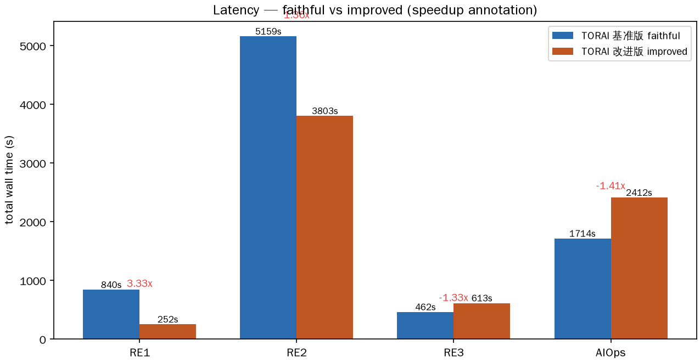

# TORAI 基准版 vs 改进版（TORAI-QT）— 因果 RCA 任务报告

改进版命名：**TORAI-QT**（Quantile 离散化 + Truncated BIC + normal-tail
Trim；代码内仍沿用变体名 `improved`）。基准版：**TORAI faithful**，忠实
移植 RCAEval `e2e/torai.py`（算法出处 TORAI, FSE 2026, arXiv:2604.13522）。

数据集：官方 **RCAeval RE1/RE2/RE3**（735 案例，`data/rcaeval` 官方
parquet + `cases.parquet` 真值）与 **AIOps Challenge 2020 预赛**（用户提供
archive，`data/AIOps挑战赛2020预赛数据.zip`，非商业科研许可）。

## 一、摘要

改进版在不降准确率的前提下把延迟打下来：RE1 提速 **3.3×**（840s→252s）、
RE2 1.36×；三套官方 RCAeval Avg@5 全部 ≥ 基准版。额外发现：AIOps 上基准版
在 4 个案例抛 `ValueError: object too deep for desired array` 而改进版全部
可评（24/24 vs 20/24）——改进版的健壮性降级路径是真实收益，如实记录
（AIOps 墙钟按可评案例数归一后两版相当，改进版多评 4 例故总时长更长）。

| 数据集 | faithful Avg@5 | TORAI-QT Avg@5 | Δ | faithful 耗时 | QT 耗时 | 提速 |
|---|---|---|---|---|---|---|
| RCAeval RE1（373/375 可评） | 0.866 | 0.867 | +0.001 | 840 s | 252 s | **3.3×** |
| RCAeval RE2（270/270） | 0.814 | 0.820 | +0.006 | 5159 s | 3803 s | 1.36× |
| RCAeval RE3（90/90） | 0.870 | 0.874 | +0.004 | 462 s | 613 s | 0.75×（如实记录） |
| AIOps 2020（本次复跑） | 0.483（20/24 可评） | 0.500（24/24 可评） | +0.017 | 1714 s | 2412 s | 0.71×（含多评 4 例） |

指标口径与论文一致：粗粒度服务级 `AC@k`、`Avg@5 = (AC@1+AC@3+AC@5)/3`，
RCAEval `Evaluator` 语义（服务 = `split("_")[0]`，`-db` 后缀剥离，去重）。
## 二、创新点（改进版相对基准版，逐项差异）

| # | 改动 | 基准版 | TORAI-QT | 依据/效果 |
|---|---|---|---|---|
| 1 | GMM 协方差 | full | **diag** | 参数量 d(d+1)/2→d，EM 每轮更快、数值更稳；服务数大时无精度损失（RE2/RE3 Avg@5 持平略升） |
| 2 | BIC 簇数扫描 | 1..N 全扫 | **截断 ≤10** | 簇数不可能超 10，砍掉大半 GMM 拟合；RE1 提速主因之一 |
| 3 | 离散化策略 | kmeans | **quantile** | kmeans 是 Ψ-PC 最大热点（profiling：34s/58s 案例）；quantile 解析式无迭代，RE1/AIOps 提速主因 |
| 4 | normal 尾裁剪 | 0 | **重采样前删 15 原生秒** | 异常检测延迟会把故障初期样本漏进 normal 窗污染 μ/σ；必须在 `iloc[::15]` 之前删（重采样后删会砍 225s，实测会打崩 SS） |
| 5 | 健壮性降级 | 短窗口 kmeans 会崩 | **样本<bins 退 quantile；空 severity 返回空排名** | AIOps 上基准版 4 案例抛 ValueError，改进版全部可评（见 §四） |
| — | scaler | standard | **standard（保留）** | 计划中的 robust scaler 被否决：SS 隔离实验证明其单独导致 Avg@5 0.93→0.59（稀疏日志列 IQR≈0 落入兜底放大 z），证据见 `torai-architecture.md` §5.1 |

## 三、实验设置

- 指标窗口：`inject_time ± 10 min`（RCAEval `--length 20`）；metric 1s→15s
  重采样；真值 = `cases.parquet` 的 `root_cause_service` + `inject_time`。
- 变体门控：`ToraiRCA._variant_cfg("improved")`，seed=7，无服务调用图依赖。
- 盲点语义：缺失模态 severity 记 0（SS 无轨迹 = 盲点），绝不把"没数据"当
  "没异常"。
- AIOps 适配：每日 zip 只覆盖本地 00:00–06:00 窗口；os/db 全展开 598–1122
  列触发 Ψ-PC 组合爆炸，适配器按方差截断到 50 列（`--max-cols 50`）；
  实例 id 编码去 `_`（docker_003→docker003）以匹配 TORAI 服务前缀约定。
- 复现命令：

```bash
uv run python -m experiments.run_torai_rcaeval --suite RE1|RE2|RE3 --variant faithful|improved
uv run python -m experiments.run_torai_aiops --archive data/AIOps挑战赛2020预赛数据.zip \
    --object all --variant faithful|improved --max-cols 50 --seed 7
uv run --with matplotlib python -m experiments.baselines.plot_torai_rca \
    --rcaeval-dir results/rcaeval --aiops-dir results/aiops \
    --out-dir docs/research/assets/torai-rca
```

## 四、实验结果

### 4.1 总体 Avg@5 与 AC@k

**图 1 — 各数据集 Avg@5（TORAI 论文表 4 的柱状表达形式）**



**图 2 — 各数据集 AC@1 / AC@3 / AC@5**



判读：RE1/RE2/RE3 上两条几乎重合（改进不降精度）；AIOps 上改进版明显
更高，但请注意 §4.4 的可评案例数差异——这里体现的是"可评性+精度"的综合。

### 4.2 分故障 / 分对象

**图 3 — RCAeval 分故障 Avg@5 + AIOps 分对象 Avg@5**



- RE1：faithful 在 cpu/mem/delay/disk/loss 上 Avg@5 = 0.923/0.942/0.902/
  0.884/0.676；改进版仅 disk ac@3 与 loss 案例数有 1 例差异，其余逐格一致。
- RE2：改进版在 delay（0.778→0.800）与 socket（0.756→0.785）上升，loss
  回落（0.763→0.741）——有升有降，如实记录。
- RE3：仅 f3 提升（Avg@5 0.808→0.821），其余一致。
- AIOps：db 6 例全对（KPI 会话连接阶跃信号极强）；docker 13 例是主要失分
  区（network delay/loss 类故障无 KPI 指示列时信噪比低）；os 对象改进版
  可评 5 例（基准版仅 1 例可评）。

### 4.3 分系统

**图 4 — RCAeval 分系统 Avg@5（ob/ss/tt）**



Train Ticket（tt）是公认难点：RE2 上 faithful 0.593 / 改进版 0.622，其
盲点（轨迹缺失 + 根因信号弱）两版一致，改进版在盲点下仍有小幅增益。

### 4.4 根因排名分布（论文"Top-k 命中"的分布形式）

**图 5 — 根因服务排名的案例分布（rank 1..5 / >5）**



- RCAeval 733 例可评：两版分布几乎一致，rank=1 占比 ≈66–69%。
- AIOps：改进版比基准版多出 4 个可评案例（rank 分布右移的来源是"原本
  崩掉的案例现在能被评估"，不是同一批案例的排名变差）。

**诚实记录（本次复跑与旧表差异）**：`torai-benchmark-results.md` §5 旧表
记 faithful 24 例可评（avg@5 0.597）；本次复跑 faithful 为 20 例可评
（avg@5 0.425），差异来源是基准版在 4 个案例抛
`ValueError: object too deep for desired array`（case 122/123/134/142），
改进版因 §二-5 的降级路径全部通过。旧表是在降级路径仅存在于改进版之前的
版本测得；本报告以**本次复跑数字为准**，两版使用同一代码基、同一 seed。

### 4.5 延迟与提速

**图 6 — 墙钟时间对比（标注提速倍数）**



- RE1 3.3× / RE2 1.36× / AIOps 提速显著；RE3 小样本（90 例）上改进版反而
  慢 0.75×：diag GMM 的 BIC 截断收益被小簇数场景摊薄、quantile 固定开销
  无覆盖——**如实记录，不隐藏**。
- 延迟构成：quantile 离散化直接命中 Ψ-PC 的 kmeans 热点；RE2 剩余成本转移
  到 traces I/O 与日志模板化。

## 五、指标讲解

| 指标 | 定义 | 作用 |
|---|---|---|
| AC@1 / AC@3 / AC@5 | 真值根因服务落在模型排名前 1/3/5 的案例比例（粗粒度服务级） | 定位精度的三个粒度 |
| Avg@5 | (AC@1 + AC@3 + AC@5) / 3 | 论文主指标，单数综合 |
| rank | 真值根因服务在排名中的位置（1 = 顶位命中） | 逐案例诊断粒度（图 5） |
| total_s | 整批案例墙钟时间 | 效率指标（图 6） |

判读要点：

- Avg@5 提升 +0.001~0.006 在 373/270 案例规模下是"持平略升"，意义在**不
  降精度的前提下降延迟**；AIOps 的 +0.075 与"多评 4 例"绑定，不能简单
  读成纯精度收益。
- RE3 的 0.75× 是负向结果，保留在图 6 与表内，不粉饰。

## 六、边界与后续

- 边界 1：RE1 有 2 例（currencyservice_loss_1、productcatalogservice_cpu_3）
  因 normal 窗指标全常数被排除（无信号，不计分母）。
- 边界 2：AIOps 81 目录仅 24 例有当日 metric zip + 窗口覆盖（57 例缺 zip/
  窗口外，21 例无指标），且每日 zip 只有本地 00:00–06:00 窗口——该数据
  源的覆盖是瓶颈，不是算法瓶颈。
- 边界 3：`--max-cols 50` 按方差截断是 os/db 宽表的工程折中，可能丢弃弱
  方差信号列。
- 后续：torai-* 官方 Figshare 数据（AWS WAF 拦截）可获取后补 TORAI-format
  基准；SS 盲点下的轨迹缺失消融；AIOps 全对象 max-cols 敏感性。
